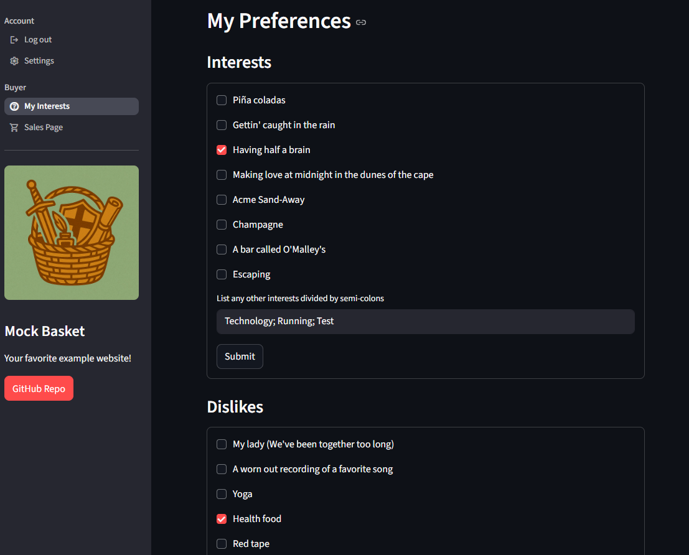
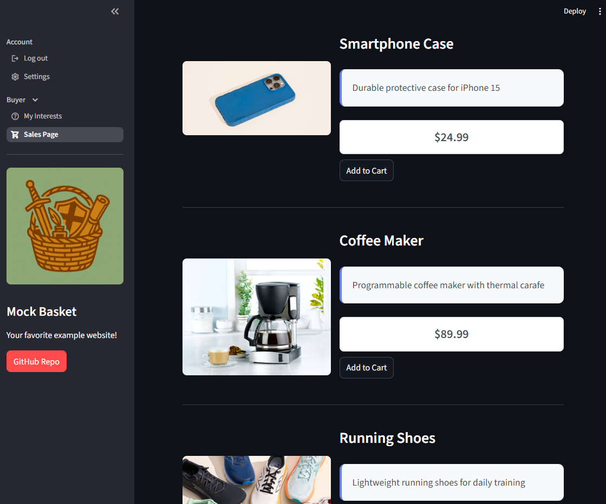
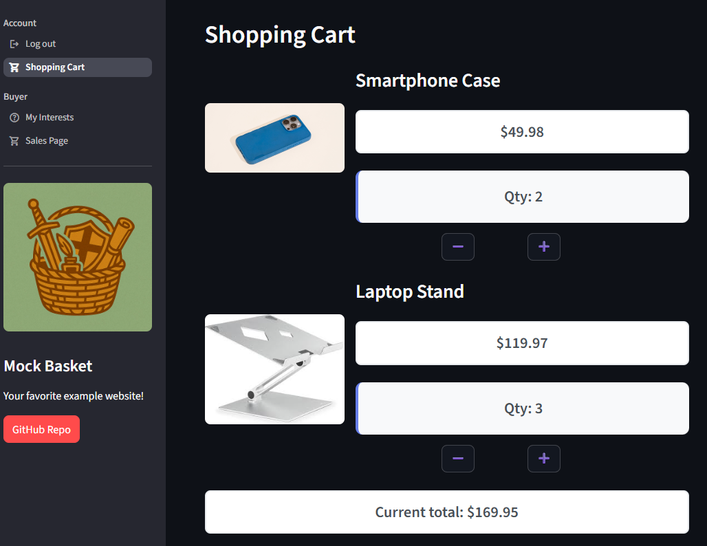
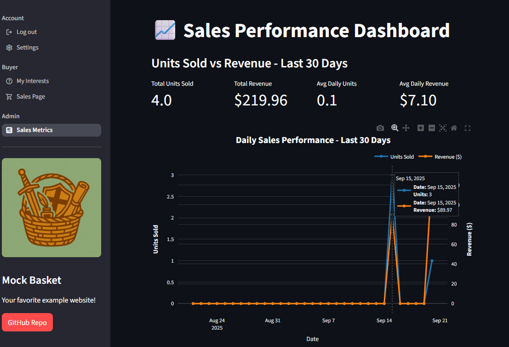
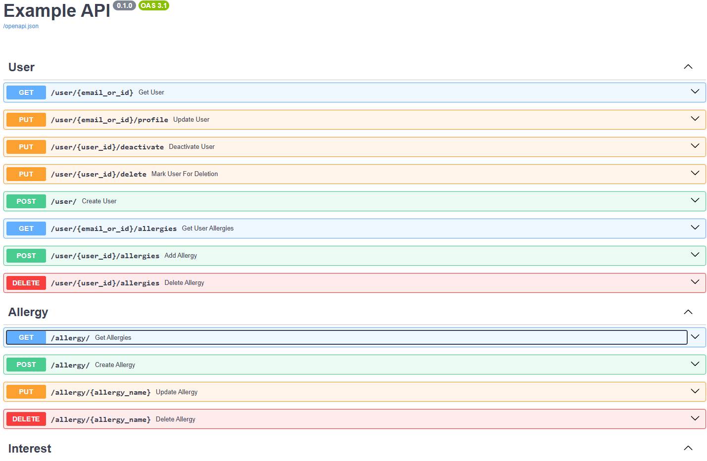
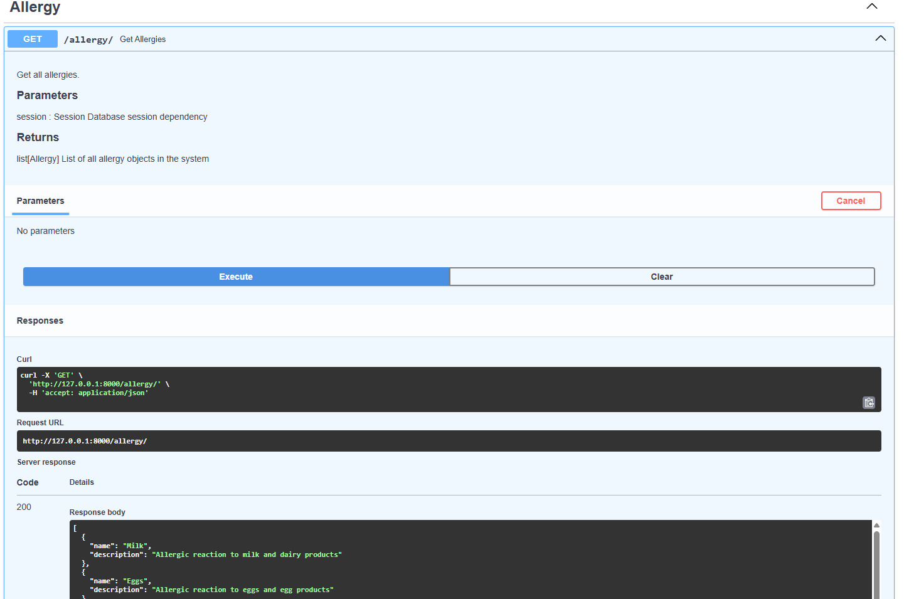
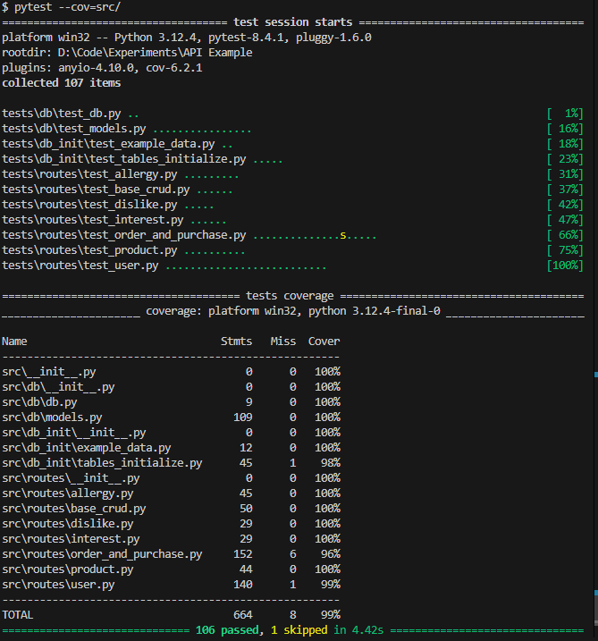

# Example API

A comprehensive FastAPI-based REST API with Streamlit frontend for user management, product catalog, and e-commerce operations. This project demonstrates modern Python web development practices with a focus on clean architecture, comprehensive testing, and robust database management.

## Features

- **RESTful API Design**: Follows REST philosophy principles
- **Streamlit Frontend**: Interactive web interface with role-based access control
- **Comprehensive Testing**: Full test coverage with pytest
- **Product Catalog**: Product management with inventory tracking
- **Order System**: Advanced shopping cart with real-time quantity updates, automatic total calculation, and seamless checkout process
- **Interest/Preference System**: User interest, dislike, and allergy tracking
- **Sales Analytics**: Admin dashboard with interactive charts and metrics

## Frontend Interface

### Frontend Features

- **Role-based Navigation**: Different interfaces for Buyers and Admins
- **User Preferences Management**: Manage interests, dislikes, and allergies
- **Product Catalog**: Browse and purchase products with detailed information
- **Shopping Cart**: Interactive cart management with real-time quantity updates and checkout
- **Sales Analytics Dashboard**: Interactive charts and metrics for administrators

### Frontend Examples









## Architecture

The project follows a clean, modular architecture:

```
src/
├── db/           # Database models and connection
├── routes/       # API endpoint definitions
├── db_init/      # Database initialization and sample data
└── tests/        # Comprehensive test suite

frontend/
├── streamlit_app.py    # Main Streamlit application entry point
├── user_and_requests.py # API client and user management utilities
├── menu.py             # Navigation and role management
├── shopping_cart.py    # Shopping cart functionality and display
├── users/              # User-facing pages (preferences, sales)
├── admin/              # Admin-only pages (analytics, management)
└── tests/              # Frontend test suite
    ├── conftest.py     # Test configuration and fixtures
    └── test_app.py     # Streamlit application tests
```

### Core Components

- **FastAPI**: Modern, fast web framework for building APIs
- **Streamlit**: Interactive web application framework for the frontend
- **SQLModel**: Combines SQLAlchemy and Pydantic for type-safe database operations
- **PostgreSQL**: Robust relational database backend
- **Pytest**: Testing framework with coverage reporting

## Running the app in Docker

The project includes a complete Docker setup with all services containerized for easy deployment and development.

### Prerequisites

1. **Docker Desktop**: Make sure you have Docker Desktop installed and running
2. **Docker Compose**: Ensure Docker Compose is available (included with Docker Desktop)

### Quick Start

1. **Clone the repository** (if not already done)

   ```bash
   git clone <repository-url>
   cd api-example
   ```

2. **Start all services**

   ```bash
   docker compose up
   ```

   This will start:

   - **PostgreSQL Database** (port 5432) - Database backend
   - **Database Initialization** - Sets up tables and sample data
   - **FastAPI Backend** (port 8000) - REST API server
   - **Streamlit Frontend** (port 8501) - Web interface

3. **Access the application**
   - **API Documentation**: http://localhost:8000/docs
   - **Frontend Interface**: http://localhost:8501

### Docker Services

The Docker Compose setup includes four services:

- **`db`**: PostgreSQL 17.6 database with persistent storage
- **`db_init`**: Database initialization service that creates tables and populates sample data
- **`api`**: FastAPI backend server with automatic reloading
- **`streamlit`**: Streamlit frontend application

### Environment Variables

The Docker setup uses the following environment variables (automatically configured):

```env
DB_USER=postgres
DB_PASS=postgres
DB_NAME=postgres
DB_HOST=db
DB_PORT=5432
```

## API Documentation

Once the server is running, you can access:

- **Interactive API Docs**: `http://localhost:8000/docs` (Swagger UI)



## API Endpoints



### Users (`/user`)

- `GET /user/{email_or_id}` - Get user by email or ID
- `POST /user/` - Create new user
- `PUT /user/{email_or_id}/profile` - Update user profile
- `PUT /user/{user_id}/deactivate` - Deactivate user account
- `PUT /user/{user_id}/delete` - Mark user for deletion
- `GET /user/{email_or_id}/allergies` - Get user allergies
- `POST /user/{user_id}/allergies` - Add allergy to user
- `DELETE /user/{user_id}/allergies` - Remove allergy from user

### Products (`/product`)

- `GET /product/` - List all products
- `GET /product/{product_id}` - Get product by ID
- `POST /product/` - Create new product
- `PUT /product/{product_id}` - Update product
- `DELETE /product/{product_id}` - Delete product

### Shopping Cart & Orders (`/buy`)

- `GET /buy/{user_id}` - Get all orders for a user (including cart and completed orders)
- `POST /buy/` - Add product to cart or add it to a new cart
- `PUT /buy/` - Update product quantity in cart
- `DELETE /buy/` - Remove product from cart by setting quantity to 0
- `POST /buy/checkout/{user_id}` - Checkout cart and complete order

### Allergies (`/allergy`)

- `GET /allergy/` - List all allergy types
- `POST /allergy/` - Create new allergy type
- `PUT /allergy/{allergy_name}` - Update allergy type
- `DELETE /allergy/{allergy_name}` - Delete allergy type

### Interests (`/interest`)

- `GET /interest/{user_id}` - Get user interests
- `POST /interest/` - Create new interest type
- `PUT /interest/{interest_id}` - Update interest type
- `DELETE /interest/{interest_id}` - Delete interest type

### Dislikes (`/dislike`)

- `GET /dislike/{user_id}` - Get user dislikes
- `POST /dislike/` - Create new dislike type
- `PUT /dislike/{dislike_id}` - Update dislike type
- `DELETE /dislike/{dislike_id}` - Delete dislike type

## Testing

Run the test suite with coverage:

```bash
# Run tests with coverage report
pytest --cov=src

# Run specific test file
pytest tests/routes/test_user.py

```

### Current coverage



## Database Models

### Core Entities

- **User**: Personal information, address, account status
- **Product**: Product details, pricing, inventory with quantity tracking
- **Order**: Shopping cart and order management with checkout status
- **Purchase**: Individual items within orders with quantity and total amount calculation
- **Allergy**: Predefined allergy options
- **Interest**: User preference categories
- **Dislike**: User aversion categories
- **UserAllergy**: Association table for many-to-many relationship between users and allegies

### Key Features

- **SQLModel Relationships**: For pythonic cross-table interactions in both One-to-Many and Many-to-Many formats
- **Enum-based Status Tracking**: Order statuses and user conditions
- **Validation**: Phone number validation (E.164 format), email validation
- **Audit Fields**: Creation and update timestamps

## Code Quality

The project maintains high code quality standards:

- **Pylint**: Static code analysis and linting
- **Black**: Automatic code formatting
- **Type Hints**: Comprehensive type annotations
- **Docstrings**: Detailed documentation for all functions and classes

## Development

This project demonstrates a full-stack application with both REST API backend and interactive web frontend. The architecture separates concerns between data management (FastAPI), user interface (Streamlit), and database operations (SQLModel with PostgreSQL).

## License

This project is licensed under the MIT License. This is just an example, but I suppose you're welcome to it if you really like it.

**Built with FastAPI, Streamlit, SQLModel, and modern Python practices**
